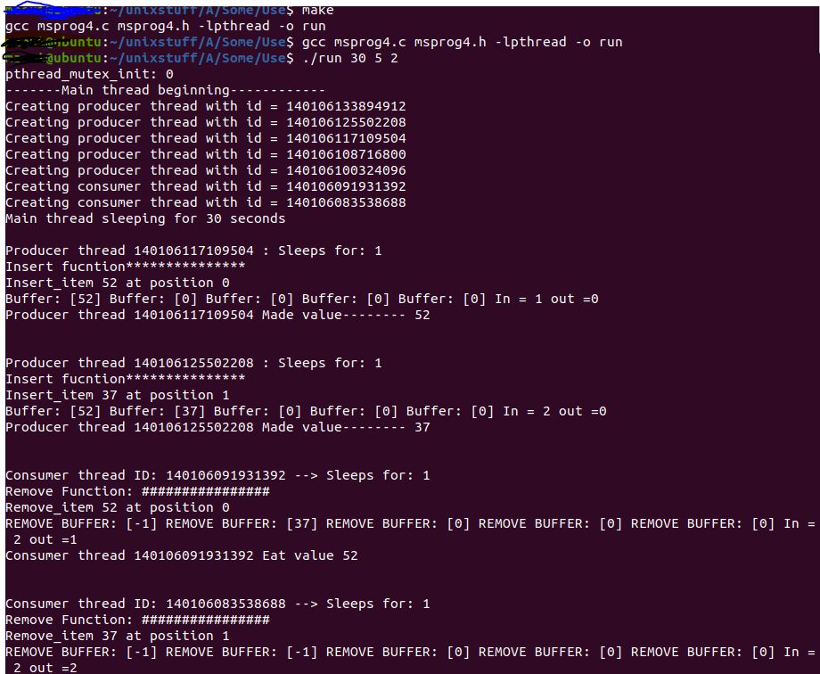
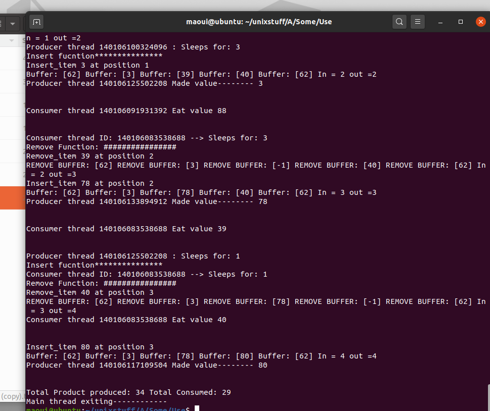

# OS Assignment using pthreads-producer-consumer 

### Linux Terminal running program with make file

### Program reqires 3 inputs in this example I added 30 seconds sleep time number of porducers is 5 and consumers is 2
### Producer Thread is created with id's and consumer there is buffer with 5 slots and once they producer makes something then its put into the buffer then consumer is assigned if one available leds to consumer consuming the item in buffer
### Program runs until time runs out, and it tries to consume all the things in buffer

